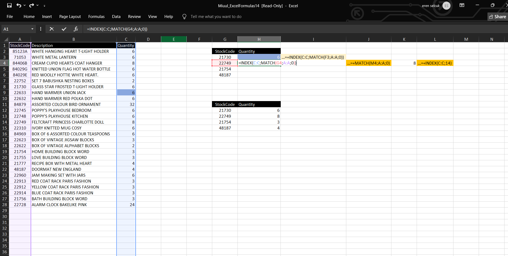

# Excel: INDEX-MATCH vs VLOOKUP

This project demonstrates how to use `INDEX-MATCH` and `VLOOKUP` functions in Excel to retrieve specific values based on a StockCode (e.g., quantity sold). It's part of my Excel practice for data analysis.

---

## 📌 What does it solve?

You have two tables:
- One table contains `StockCode` and sales data (`Quantity`)
- The other table needs to **look up** how many units were sold for a given StockCode

---

## 🧮 1. INDEX-MATCH Method

This is a two-step lookup:

```excel
=INDEX(range_to_return_value, MATCH(lookup_value, range_to_search, 0))
```
```excel
=INDEX(C:C), MATCH(G3, A:A, 0))
```


G3: StockCode we want to look up (e.g., 21730)

A:A: Column where we search for the StockCode

D:D: Quantity values we want to return


```excel
=VLOOKUP(lookup_value, table_array, column_index, FALSE)
=VLOOKUP(F3, A:D, 4, FALSE)
```


F3: StockCode to search

A:D: The full table

4: Column number in the table where the value to return is found (Quantity)

FALSE: Ensures exact match

---
🖼️ Step-by-step INDEX-MATCH
Writing the INDEX part

What we want to find: Quantity

What to match with: StockCode from G3

Where to look for the StockCode: Column A

Final result: Quantity found

🔍 VLOOKUP Method (Classic Lookup)
This method searches for a value in the first column of a table and returns the value from a specified column in the same row.

🔢 Formula Syntax:
=VLOOKUP(lookup_value, table_array, col_index_num, [range_lookup])
✅ Example Used:

```excel
=VLOOKUP(F3, A:D, 4, FALSE)
```
F3: The StockCode to find

A:D: Full data table

4: 4th column in the table (Quantity)

FALSE: For exact match


